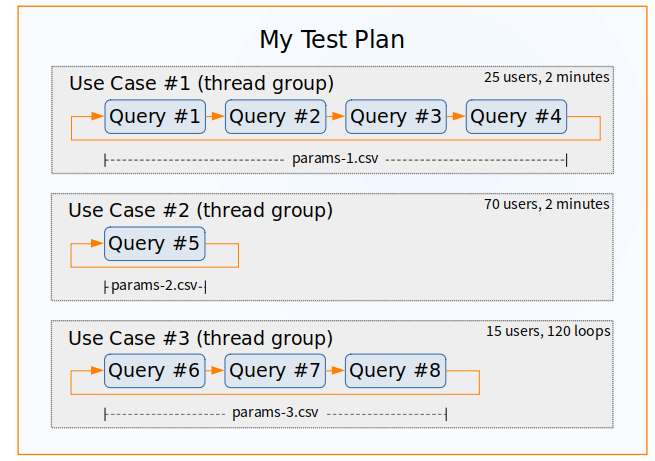

# JMeter SQL Database Load Test

This short guide shows the steps to run a load test on a database using JMeter. 

The example shows 1 simultaneous user with one use case, that in turn has one step (a database query). 
It can easily be changed to test multiple paths, each one with following multiple steps.

This example includes a realistic scenario where each user operates the app with different
search parameters, defined in a CSV file.


## Basic Concepts

JMeter applies loads on a database by running queries on it simulating one or more use cases where each one
corresponds to a sequence of steps (SQL queries).

The image below depicts one test plan with three use cases (thread groups).



The first use case has four steps, the second one a single one, and the third one has three steps. Each step
represents a database query execution.

In short, a test plan can have many thread groups to represent different groups of people doing different tasks. All thread 
groups of a test plan are then executed simultaneously, each one producing different load in the server. Also, 
each thread group can have different size (number of users) and different number of steps to follow.

### Takeaways

1. A **Load Test Plan** includes one or more use cases.
1. A **Use Case** (called "Thread Group" in JMeter) represents a group of users performing one task.
1. A use case includes one or more **Steps** that are executed sequentially. In a
database load test each step is a query that is executed.
1. Once a step completes in a use case, then the next step is executed, and so on, sequentially.
1. Once the last step is complete, then one **Loop** of the use case is considered complete.
1. A use case can be configured to be run by one or many **Simultaneous Users**. The number of simultaneous users should be configured by the tester, **separately** on each use case.
1. A use case can be configured to run for a specific **amount of time** or for a specific **number of loops**, in order to simulate a more realistic load. If an amount of time is specified it will
run many loops during the allocated amount of time.
1. To defeat server caches the queries needs to be run with **Different Parameters** each time. These parameters should be loaded from a CSV file and applied to the query using the form `${parameterName}`.
1. The parameters need to be distinct to avoid caches. It's also recommended that the parameters be somewhat random. Finally, the minimum number of different parameters should be at least 100, and ideally more than that, around 200, 500 or more. That is, each CSV file should ideally have 200 lines at least.
1. The parameters are shared across the whole use case. If multiple queries need different parameters they need to be compiled together in a single CSV file. Each query can pick which parameter to use.
1. For each use case the developers should provide the starting point of:
    - Number of simultaneous users
    - Amount of time or number of loops
1. After the initial test rounds the tester will increase or decrease the simultaneous users and amount of time/loops to test higher or lower loads.


## Part 1 &ndash; Install JMeter

First, we'll need to download and install JMeter:

1. Download the JMeter 5.5 ZIP file from [JMeter Downloads](https://jmeter.apache.org/download_jmeter.cgi).
1. Extract the zip file contents to a directory of your choosing that we'll call `<JMETER_HOME>`.
1. JMeter 5.5 requires Java 8 (or newer) installed on the system.
1. Copy the JDBC driver of your database into `<JMETER_HOME>/lib`.


## Part 2 &ndash; Design a Load Test

The design of the load test is done in any computer. We'll design it and run it locally in "GUI Mode" to check it
works correctly. We'll save it as a .jmx file. To get meaningful readings for the official load testing we'll then run it in "Headless Mode".

### 1. Create an Empty Test

Start JMeter in GUI mode. Go to the command line and type:

```bash
<JMETER_HOME>/bin/jmeter
```

The JMeter UI will start and you'll get a new empty Test Plan. Change its name to "My Test Plan" or whichever name
makes sense to you. Save the JMeter Load test in a .jmx file. For example, as `load-test-1.jmx`.


### 2. Define the Database Connection

Add the **JDBC Connection Configuration** to the Test Plan:

Right-click on the Test Plan. Then: > `Add` > `Config Element` > `JDBC Connection Configuration`

- **Name**: `DB Connection to DEV1`
- **Variable Name for created pool**: `dev1`
- **Max Number of Connections**: `10` (increase as needed)
- **Database URL**: `<jdbc-url>`
- **JDBC Driver Class**: `<jdbc-driver-class>`
- **Username**: `<db-username>`
- **Password**: `<db-password>`


### 3. Add a Use Case

A **Thread Group** represents one use case that includes multiple users that are following the same sequence of steps (with different parameters).

In this example we will create a single Thread Group with a single step. Once this works you can expand the test with more steps and/or
more simultaneous thread groups.

Add one *Thread Group* to the Test Plan:

Right-click on the Test Plan. Then: > `Add` > `Threads (Users)` > `Thread Group`

- **Name**: `Use Case #1 - Widget Search` (The name is used in the reports; change as needed)
- **Action to be taken after a Sampler error**: `Continue`
- **Number of Threads (users)**: `1`
- **Ramp-Up Period (seconds)**: `10`
- **Loop Count**: `1`

**Note**: If later on you want to specify an amount of time (for example to 2 minutes) instead of a number of loops, change:

- **Loop Count**: `Infinite`
- **Specify Thread lifetime**: `(enable this)`
    - **Duration (seconds)**: `120`


### 4. Add One Query to the Use Case

We'll add one **JDBC Request** (a query) to the Thread Group. We can repeat this step to add
more steps to a use case.

You'll notice the query has parameters in it. This is because for a database 
load test to be meaningful the query needs to be run with different values every time. 
Otherwise the database caches the result of the query and returns it from memory instead of 
running it every time... something that would defeat the purpose of load testing. 

Also, the load test needs to use a large set of parameters, ideally of 500 different combinations 
or more for each query, in order to defeat small internal caches in the database.

Right-click on the Thread Group. Then: > `Add` > `Sampler` > `JDBC Request`

- **Name**: `Widget Search Step #1`
- **Variable Name of Pool declared in JDBC Connection Configuration**: `dev1` (as defined above)
- **Query Type**: `Prepared Select Statement`
- **SQL Query**: `select * from orders where client_id = ? and state_id = ?`
- **Parameter values**: `${client_id},${state_id}`
- **Parameter types**: `NUMERIC,VARCHAR`

**Note #1**: The SQL query, its parameter values and types are provided by a developer.

**Note #2**: In the parameter values and types, make sure you don't include spaces as separators before or after the commas.


### 5. Provide a Source for the Parameter Values

- Create the CSV file (e.g. 'params-use-case-1.csv') in the <JMETER_HOME> folder with a content like:

    ```
    client_id,state_id
    105,VA
    2041,CA
    1034,OR
    156,MO
    4322,NY
    ```

    **Note #1**: The first line specifies the parameter names, used in the SQL statement definition.

    **Note #2**: In all lines (header or values), make sure you don't include spaces as separators before or after the commas.

    **Note #3**: In this example the data set has 5 parameter combinations. These are consumed by the number of users, the number of loops, and the number of steps each use case has. If two users are set up instead of just one, each user will use different parameters in an interleaving manner.


- Add the Parameters File to the Thread Group.

    Right-click on the Thread Group. Then: > `Add` > `Config Element` > `CSV Data Set Config`
    
    - Name: `Parameters Use Case #1`
    - Filename: `params-use-case-1.csv` (defined above)
    - Recycle on EOF?: `True`
    - Sharing Mode: `All threads`


### 6. Add Listeners to Collect the Readings

Listeners will collect all the data you need when the load test is run. This is the important part. You can have many
listeners, that collect and display the information in different forms.

We will add three listeners in this example. Feel free to add only one, all three of them, or different ones entirely.
You can add them all and then enable or disable some of them at will.

- Add a "Summary Report"

    Right-click on the Thread Group. Then: > `Add` > `Listener` > `Summary Report`
    
    - **Name**: `Summary Report`
    - **Filename**: (leave empty) (optional: if specified saves the summary data to a CSV file)

- Add a "View Results in Table" (for debug purposes on the GUI only. Disable for the official load test).

    Right-click on the "SQL Load Test" Thread Group. Then: > `Add` > `Listener` > `View Results in Table`
    
    - **Name**: `View Results in Table`
    - **Filename**: (leave empty) (optional: if specified saves the table data to a CSV file)

- Add a "View Results in Tree"

    **Note**: This is for debug purposes on the GUI only. Disable for the official load test.
    
    Right-click on the Thread Group. Then: > `Add` > `Listener` > `View Results in Tree`
    
    - **Name**: `View Results in Tree`
    - **Filename**: (leave empty) (optional: if specified saves the tree data to a CSV file)


### 7. Save the JMeter (.jmx) file.


## Part 3 &ndash; Validate the Load Test

Use the GUI to run the load test (with small number of users), since it's easy to check if the queries are 
running well and that all extra items are used properly, like the parameters file.

Start with 1 user and check for errors. Then you can ramp up for a few users. Don't load test with the real
numbers of users in GUI mode. Do that with the headless mode only.


### 1. Check the Load Test works properly using the GUI

- Clear all results. Click on the Thread Group and type **Ctrl-E**
- Run the load test: **Ctrl-R**
- Check that the listeners show good results:
    - The "View Results in Tree" listener defined above is particularly useful to see any errors. It provides detailed information and errors for each case.
    - There are no JDBC connection errors.
    - The parameters are being read correctly from the parameters file.
    - The SQL is correctly executed. 


### 2. Save the JMeter (jmx) file if you made any changes

### 3. Perform a dry run of the Load Test from the command line

- To get accurate readings the load test needs to be run from the command line. Use the following syntax for the command line:

    ```
    <JMETER_HOME>/bin/jmeter -n -t [jmx file] -l [results file] -e -o [Path to output folder]
    ```

    as in:

    ```
    bin/jmeter -n -t sql-load-test1.jmx -l results-file.txt -e -o dashboard-output
    ```

    Make sure the results-file.txt file does not exist, and the the dashboard-output folder does not exist or is empty.

- You can check out the dashboard (HTML) that is generated by the last two parameters in the `dashboard-output` folder in the file `index.html`.

- By default the **T (toleration threshold)** and the **F (frustration threshold)** are set to 500 ms and 1500 ms
respectively. If your SLA requires different values (let's say 2 and 10 seconds) you change them by:

    Create a user.properties file and add the following properties:
    
    ```properties
    jmeter.reportgenerator.apdex_satisfied_threshold=2000
    jmeter.reportgenerator.apdex_tolerated_threshold=10000
    ```

- Finally, JMeter accepts several command line parameters. You can type jmeter -? to see them all. A few ones are described below:

    ```
    -n, --nongui
            run JMeter in nongui mode
    -t, --testfile <argument>
            the jmeter test(.jmx) file to run. "-t LAST" will load last 
            used file
    -l, --logfile <argument>
            the file to log samples to
    -e, --reportatendofloadtests
            generate report dashboard after load test
    -o, --reportoutputfolder <argument>
            output folder for report dashboard
    -d, --homedir <argument>
            the jmeter home directory to use
    ```


## Part 4 &ndash; Run the Official Load Test

To run the official Load Test a few precautions need to taken:

### Use the Headless Mode

Do not use the GUI for the Official Load Test.

Also, you may want to run the Official Load Test in a server that doesn't run heavy background processes such as 
an anti-virus or other heavy tasks such as patching. Avoid the time frames when any heavy process are running.  

### Save the Data in a Listener

Add a file name in a listener so the data is saved, and can be loaded by the GUI and reviewed later, or to generate
charts with it.

### No Charts
 
The command line does not generate charts or other sophisticated output from listeners that the GUI provides by default. If you need those:

1. Specify a CSV filename to save the data for each listener you want.
2. You can generate the charts or other right after the load test using the generated CSV file(s).
    
**Note #1**: Use the minimum number of listeners. Too many can slow down JMeter.
    
**Note #2**: Use the CSV format when saving data since it's fast, and doesn't produce unnecessary overhead for JMeter.

### Prepare the Real Load

Increase the Number of Threads (users) and Loop Count on the Main definition of the load test. 

For example, for 100 simultaneous users, each running a use case 30 times sequentially, click on the Thread Group. Then:

- **Number of Threads (users)**: `100`
- **Ramp-Up Period (seconds)**: `10`
- **Loop Count**: `30` (deselect "Forever")

Also, don't forget to disable the extra listeners that are not needed in the official test, so they don't interfere with it.
Run with the minimal number of listeners.

Save the jmx file! These are the values for the official load test.

### Run the Official Load Test

Use the command line form as show before:

```
<JMETER_HOME>/bin/jmeter -n -t [jmx file] -l [results file] -e -o [Path to output folder]
```

You can simulate multiple scenarios combining how many simultaneous users, and use cases SQL queries each one runs 
sequentially, in order to match your expected load in the production environment.


## Part 5 &ndash; Load Test Strategies

We consider two main strategies for load testing.


### Strategy #1 - Breaking Point

First, this strategy defines a **Response Time Limit** that is considered acceptable/tolerable.

Then it runs the load test multiple times with increasingly higher numbers of users, until it finds the
breaking point of the infrastructure/application setup.

Typically, the test runs are iterative and use:

- 10 simultaneous users.
- 20 simultaneous users.
- 50 simultaneous users.
- 100 simultaneous users.
- 200 simultaneous users.
- 500 simultaneous users.
- 1000 simultaneous users.
- 2000 simultaneous users.
- 5000 simultaneous users.
- more as needed.

Each stress level is run separately. The load is increased for the next iteration, until it's determined that its
response time has exceeded the predefined *Response Time Limit*.

For example, if we define the response time limit is 15 seconds, then we will stop the iterative testing when the
iteration produces response times that exceed this threshold.


### Strategy #2 - Baseline

This strategy assumes the application is already running at Infrastructure #1 and we want to check if it
will run well at Infrastructure #2.

#### Step 1: Define the Stress Level

In this case, we typically decide de stress level a priori. For example, we may decide that our application is 
expected to work well with 200 simultaneous users.

#### Step 2: Baseline Infrastructure #1

We first retrieve the response times at Infrastructure #1: we get the "Baseline Response Times".  

Typically, a couple of different relevant stress are selected. For example, we may decide that there are two relevant stress levels for us:

- 100 simultaneous users.
- 200 simultaneous users.

Both stress levels are run at Infrastructure #1 and their corresponding response times are recorded.

#### Step 3: Measure the New Infrastructure

Then, we run the same stress levels at Infrastructure #2. In this case, we'll run for 100 and 200 users again. 

Typically the result is considered acceptable, when the response time at the second infrastructure is similar or
better (lower) than the Baseline Response Times.


